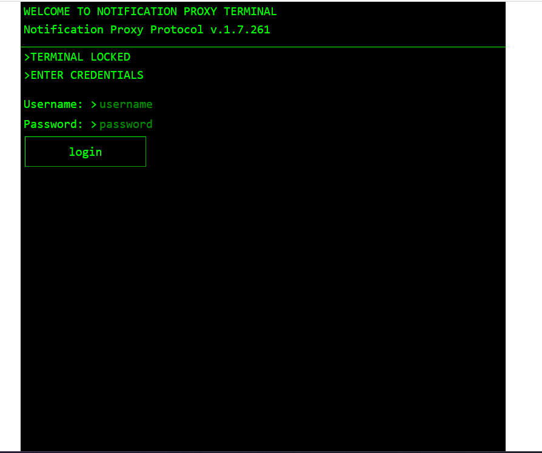
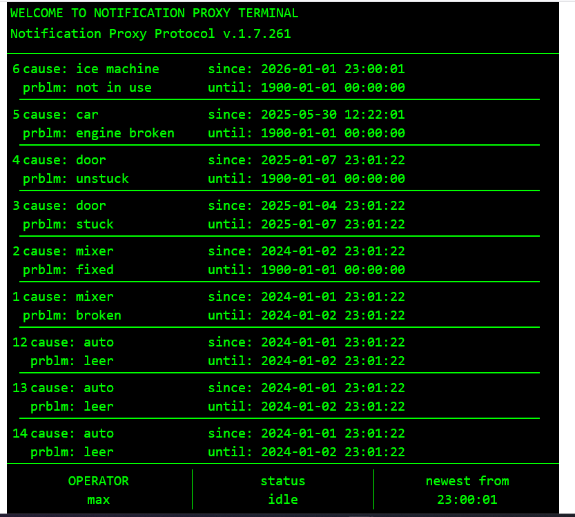

## Table of Contents
- [About](#About)
- [How to Use](#how-to-use)

## About
to be used with the corresponding [backend](https://github.com/HydraulicRobert/dbProxy)

## how-to-use
follow the instruction on [backend](https://github.com/HydraulicRobert/dbProxy#how-to-use)

start the frontend using 
```shell
npm run dev
```

make sure the url and port for the backend are set in the file variables/weburl.txt

-access the frontend using the frontend pc's ip and port, ip:5173.

-login using the added userdata for the backend

.

-when successful you'll get to the list of all cached notifications.



version number will stay identical

clickable list in the middle

footer has your username, the current frontend's status and time 
